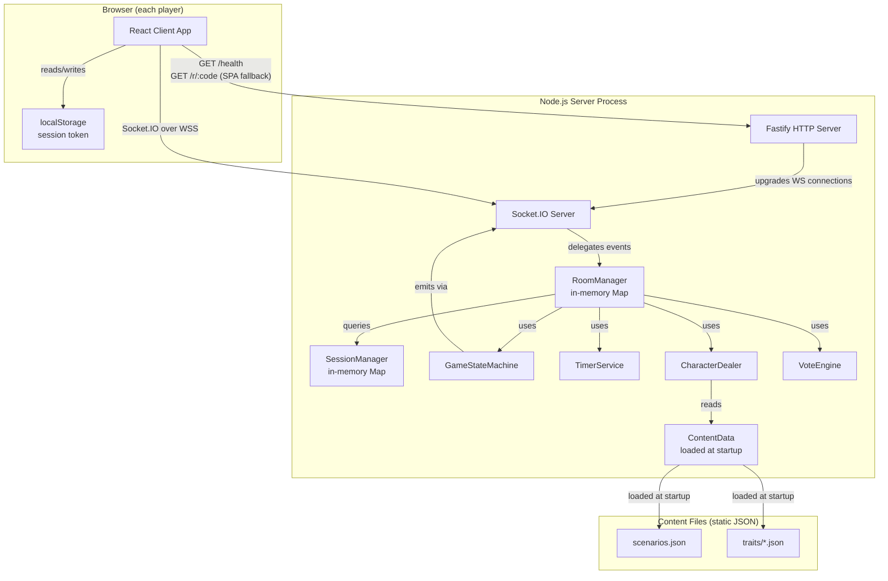
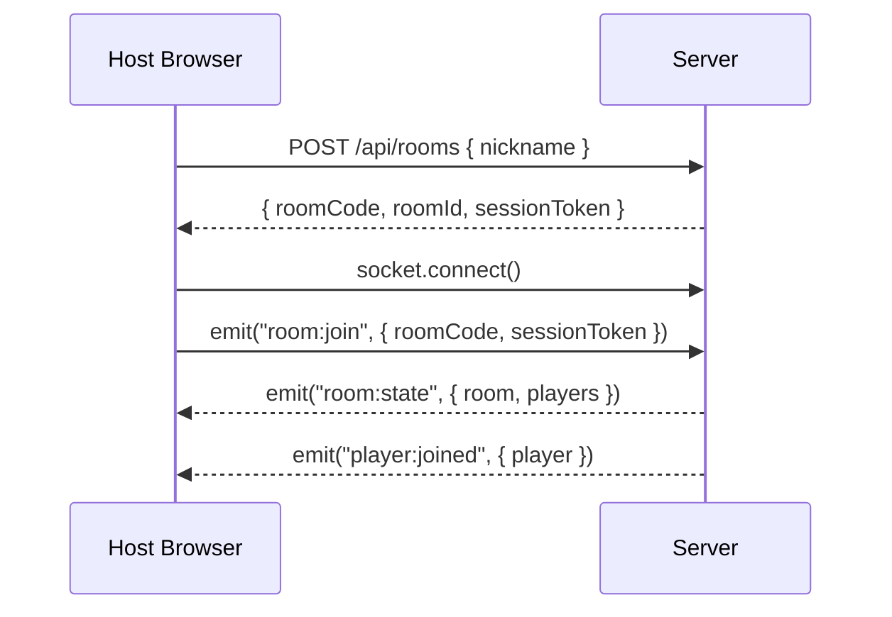
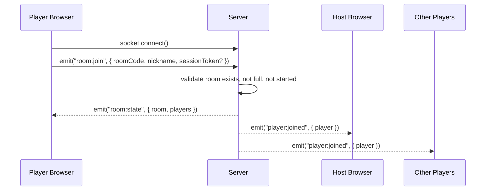
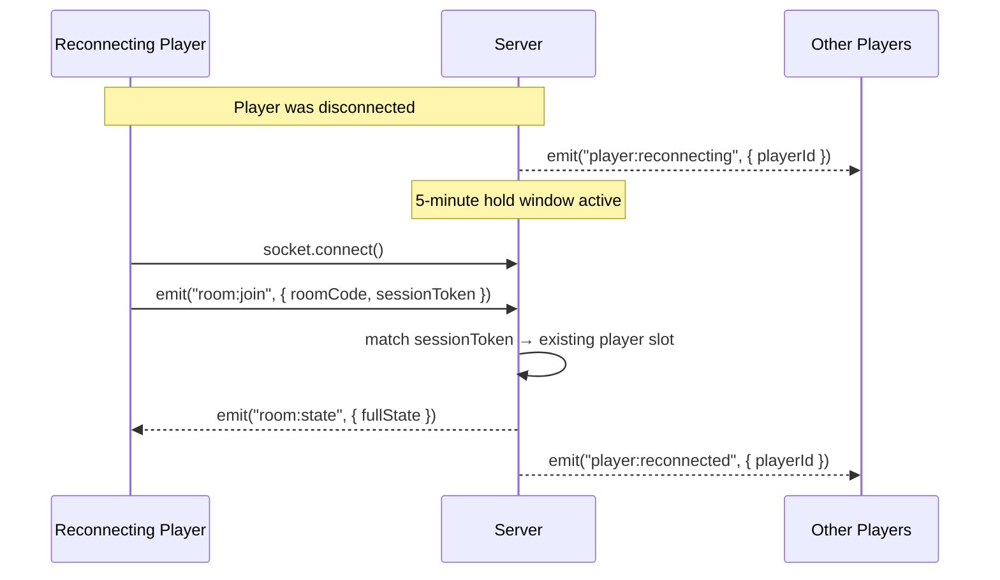
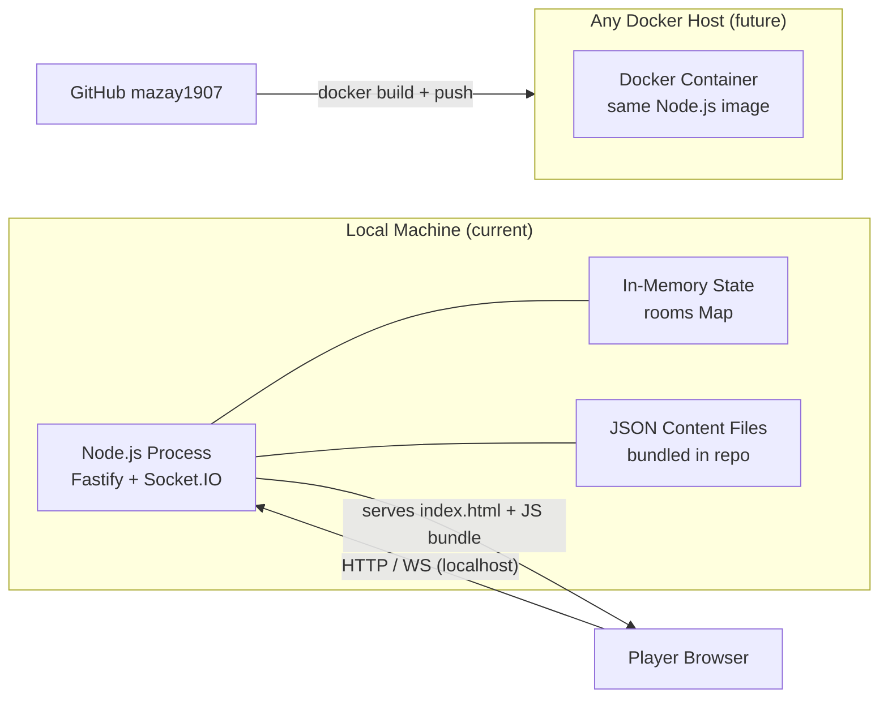

# System Design — Bunker Team Game

**Project:** bunker-team-game
**Version:** 0.1
**Quality Mode:** MVP
**Last Updated:** 2026-05-31
**Author:** Solution Architect Agent

---

## Architecture Overview

The system is a **single-server real-time web application** structured as a pnpm monorepo with three packages: a React frontend client, a Fastify + Socket.IO backend server, and a shared TypeScript types package. All game state lives in memory on the server process. Content (scenarios, traits) loads from JSON files at startup.

This is intentionally the simplest architecture that fully supports the MVP feature set, while making the upgrade path to Phase 2 (Postgres, Redis, accounts) a matter of adding new implementations — not rewriting existing ones.

---

## Component Diagram



---

## Request / Event Flow Diagrams

### Room Creation Flow



### Player Join Flow



### Game Round Flow (Reveal → Debate → Vote → Eliminate)

```mermaid
sequenceDiagram
    participant ALL as All Clients
    participant S as Server

    S-->>ALL: emit("phase:changed", { phase: "REVEAL", round: N, quota: 2 })
    Note over S,ALL: Rolling reveal — each submission broadcasts immediately
    ALL->>S: emit("reveal:submit", { categories: [...] })  [each player, independently]
    S-->>ALL: emit("reveal:update", { playerId, revealedTraits, waitingFor: N-1 })
    Note over ALL: Other players see traits as they arrive; cannot change own after submit
    Note over S: Reveal phase ends when ALL active players have submitted (no timer at MVP)
    S-->>ALL: emit("phase:changed", { phase: "DEBATE", timerSeconds: 300 })
    S-->>ALL: emit("timer:tick", { remaining })  [every second]
    Note over S: Timer ends OR host force-advances
    S-->>ALL: emit("phase:changed", { phase: "VOTE" })
    ALL->>S: emit("vote:submit", { targetId })  [each player]
    S-->>ALL: emit("vote:update", { voterId, targetId })
    Note over S: All votes in OR timeout
    S->>S: tally votes, resolve ties
    S-->>ALL: emit("player:eliminated", { playerId, character })
    S-->>ALL: emit("phase:changed", { phase: "REVEAL", round: N+1 })
```

**Rolling reveal behaviour (confirmed):** When a player confirms their trait selection, those traits are immediately broadcast to all connected clients via `reveal:update`. The reveal phase ends only when ALL active (non-eliminated, connected) players have submitted. Players who have already submitted cannot change their selection. Players who have not yet submitted can see each other's revealed traits as they come in.

**Reveal timer (MVP):** The reveal phase has no time limit at MVP. `TimerService` has a placeholder for a reveal countdown that can be wired in Phase 2 (P2) without any architecture changes.

### Reconnect Flow



---

## Server Module Responsibilities

### RoomManager
The central coordinator. Owns the in-memory Map of all active rooms. Handles all Socket.IO events for room lifecycle (create, join, leave, kick, expiry). Delegates game logic to sub-services.

### GameStateMachine
Enforces the linear state sequence: `LOBBY → SCENARIO_PICK → R1_REVEAL → R1_DEBATE → R1_VOTE → R2_REVEAL → R2_DEBATE → R2_VOTE → R3_REVEAL → R3_DEBATE → R3_VOTE → ENDED`. State transitions are server-authoritative. Emits `phase:changed` events to all room members on every transition.

### SessionManager
Maps session tokens (from client localStorage) to player slots. Handles the 5-minute reconnect window: stores a disconnected player's slot as "pending" for 300 seconds before triggering auto-elimination.

### CharacterDealer
At game start: samples 6-10 characters from the trait pool (one per category, unique combination per player). Uses a Fisher-Yates shuffle per category, then assembles character cards. Guarantees no two players share an identical full card.

### VoteEngine
Manages the voting phase for a round: collects votes, enforces no-self-vote, detects completion, resolves ties (re-vote → host tiebreaker → longest-connected tiebreaker), returns the eliminated player ID.

### TimerService
Manages server-side countdowns (debate timer, disconnect hold windows, host-transfer timer). Emits `timer:tick` events. Supports extend, cancel, and query operations. All timers are stored as setTimeout handles; cleared on room expiry to prevent memory leaks.

### ContentData
Loads `scenarios.json` and all `traits/*.json` at process startup. Exposes read-only accessors. Never mutated at runtime.

---

## Deployment Diagram



**Current deployment:** The server runs on the developer's local machine with `pnpm dev`. Invite links use `localhost`. No hosting account or domain is required.

**Future deployment:** A `Dockerfile` (multi-stage, `node:22-alpine`) and `docker-compose.yml` are included in the repo from Sprint 0. When the project is ready to host, running `docker compose up` on any Docker-compatible platform (Railway, Render, Fly.io, bare VPS) produces a running instance. No platform-specific code changes are required.

**Note on static serving:** Fastify serves the React build's `dist/` folder directly from the Node process (no separate CDN). This is simpler and sufficient for a small team. Phase 2 can move static assets to a CDN if load increases.

---

## Key Design Decisions

### Server-Authoritative State
All game state lives on the server. Clients are views of server state — they do not calculate round results, vote tallies, or phase transitions. This prevents cheating and simplifies reconnect re-sync (server sends full state, client renders it).

### Single Source of Truth for Phase
`room.currentPhase` on the server is the only truth. Every client action that depends on the current phase is validated server-side before execution. A client cannot force a phase transition by emitting events.

### No Database Coupling at the Application Layer
All storage access goes through the `RoomStore` and `SessionStore` interfaces. The in-memory implementations are injected at startup. Replacing them with Redis or Postgres implementations in Phase 2 does not touch the game logic layer.

### Shared Types Package
`packages/shared` exports TypeScript interfaces for all Socket.IO event payloads. Both `packages/client` and `packages/server` import from it. A type mismatch between client emit and server listener is a compile-time error, not a runtime bug.

### Content as Data, Not Code
Scenarios and traits live in JSON files outside the application packages. They are loaded once at startup. The game engine references trait entries by ID. Adding a new scenario or trait category is a JSON edit, not a code change.

### Play Again Always Shows Scenario Picker
When the host clicks "Грати ще раз" from the end screen, the game state machine resets to `SCENARIO_PICK`. The scenario picker modal opens unconditionally — the previous scenario is not carried over. The same player slots are preserved; new character cards are dealt after the host picks a scenario. This is the confirmed behaviour: there is no "rematch with same scenario" shortcut in MVP.

---

## Scalability Constraints (MVP Acknowledged)

| Constraint | Impact | Phase 2 Resolution |
|---|---|---|
| Single Node.js process | All rooms share one process; ~50-100 concurrent rooms safely | Redis pub/sub + multiple Node processes |
| In-memory state | Server restart drops all active rooms | Redis for room/session state |
| No DB | No room history, no cross-session stats | PostgreSQL |
| Fastify serving static files | Adds minor latency to static asset delivery | Cloudflare or CDN in front |

None of these constraints affect the target use case: 1-10 concurrent rooms, owner's team, 2-3 weeks MVP timeline.
